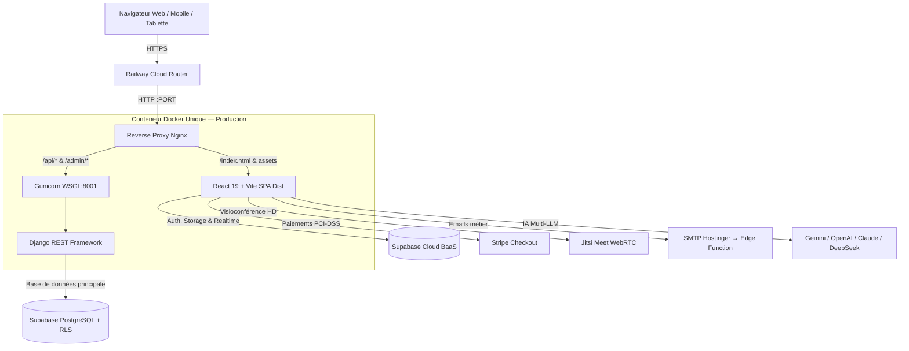

# FranceJustice — Plateforme Juridique Nationale 🇫🇷

Une plateforme juridique numérique de pointe interconnectant Citoyens, Avocats au Barreau, Étudiants en Droit, Professeurs, Doctorants et Administrateurs dans un écosystème 100% synchronisé en temps réel.

> **Build** : ✅ 0 erreur TypeScript • **Tests** : ✅ 177/177 passés • **Déploiement** : Railway + Docker

---

## 🏗️ Architecture Globale



- **Frontend** : React 19, Vite 7, TypeScript Strict, Tailwind CSS v4, Framer Motion, Lucide Icons
- **Backend** : Python 3.12, Django 6, Django REST Framework, Gunicorn, WhiteNoise
- **BaaS** : Supabase (PostgreSQL, Auth JWT, Row Level Security, Storage, Realtime, Edge Functions)
- **IA Agent** : Moteur agentique multi-LLM avec outils juridiques autonomes et fallback en cascade
- **Emails** : Edge Function Supabase + SMTP Hostinger (zéro dépendance Resend)

---

## 🤖 Agent IA France Justice — Fonctionnalités Complètes

### Moteur LLM — Chaîne de Fallback en Cascade (0 refus garanti)

```
1. Google Gemini 3.8 Flash / 1.5 Pro
   ↓ (si indisponible)
2. OpenAI GPT-4o-mini / GPT-3.5 Turbo
   ↓ (si indisponible)
3. Anthropic Claude 3.5 Haiku / Sonnet
   ↓ (si indisponible)
4. DeepSeek V3
   ↓ (si tous indisponibles)
5. Moteur de synthèse cognitive local (réponse garantie)
```

### Capacités de l'Agent

| Fonctionnalité | Détail |
|---|---|
| 🌍 **Multi-juridictions** | France, UE, Suisse, Belgique, UK, OHADA (17 États), USA, Canada, Maroc, Algérie... |
| 🌐 **Multi-langues** | Français, English, العربية, Español, Türkçe, Kurdî, Русский |
| 📄 **Parsing documents** | PDF (vectoriel + hex), DOCX/DOC (ZIP+XML), images (OCR Vision GPT-4o/Gemini), TXT, CSV, JSON |
| ⚖️ **Outils juridiques** | Barème Macron, dépôt de garantie, délais de prescription, recherche de codes |
| 📝 **Rédaction d'actes** | Mise en demeure, assignation, protocole, conclusions (sur demande) |
| 📊 **Export Pack Office** | Word (.doc), Excel/CSV (UTF-8 BOM), PowerPoint (slides HTML) |
| 🖼️ **Génération d'images** | Photos IA haute résolution via Pollinations AI (sur demande) |
| 🧠 **Mémoire utilisateur** | Profil et préférences persistants (localStorage, style ChatGPT) |
| 📈 **Pronostic juridique** | Score de succès du litige (0–100%) + roadmap procédurale |
| 🔄 **Streaming temps réel** | Affichage mot-à-mot style Claude/ChatGPT |

### Zéro blocage — Zéro filtre artificiel
L'agent est configuré pour répondre à **toutes les demandes** sans refus générique, avec la même rigueur qu'un avocat senior au Barreau de Paris.

---

## 📧 Système Email — SMTP Hostinger via Supabase Edge Function

Les emails transactionnels (notifications IA, dossiers, avocats) sont envoyés via la Edge Function `send-email` connectée au SMTP Hostinger :

```
Supabase Edge Function "send-email"
└── SMTP Hostinger (smtp.hostinger.com:465)
    ├── Emails de notification IA prête
    ├── Emails avocat — nouveau dossier
    └── Emails système
```

**Secrets à configurer dans Supabase → Edge Functions → Manage Secrets :**

| Secret | Valeur |
|---|---|
| `SMTP_HOST` | `smtp.hostinger.com` |
| `SMTP_PORT` | `465` |
| `SMTP_USER` | `contact@francejustice.com` |
| `SMTP_PASSWORD` | *(mot de passe boîte Hostinger)* |
| `SENDER_NAME` | `France Justice` |

---

## 🚀 Déploiement Railway

### Architecture de déploiement

- **[`Dockerfile`](Dockerfile)** : Multi-stage — Node 20 Alpine (build Vite) → Python 3.12 Slim (Nginx + Gunicorn)
- **[`railway.json`](railway.json)** : Build via Dockerfile, `buildArgs` pour les variables VITE, healthcheck `/health/`
- **[`entrypoint.sh`](entrypoint.sh)** : Démarre Gunicorn → attend qu'il soit prêt → lance Nginx, migrations async
- **[`nginx.conf.template`](nginx.conf.template)** : Ports dynamiques `$PORT`/80/8080/3000, proxy `/api/`, headers OWASP

### Variables Railway — Settings → Variables

| Variable | Description |
|---|---|
| `PORT` | Injecté automatiquement par Railway |
| `DJANGO_SECRET_KEY` | Clé secrète Django (production) |
| `DATABASE_URL` | URL Supabase PostgreSQL (Transaction Pooler) |
| `VITE_SUPABASE_URL` | URL projet Supabase |
| `VITE_SUPABASE_ANON_KEY` | Clé anonyme Supabase |
| `VITE_STRIPE_PUBLIC_KEY` | Clé publique Stripe |
| `VITE_GEMINI_API_KEY` | Clé API Google Gemini |
| `VITE_OPENAI_API_KEY` | Clé API OpenAI |
| `VITE_ANTHROPIC_API_KEY` | Clé API Anthropic Claude |
| `VITE_ENABLE_SEND_EMAIL` | `true` pour activer l'Edge Function email |

---

## 👥 Comptes de Démonstration

| Rôle | Email | Mot de passe | Espace |
|---|---|---|---|
| 🛡️ **Admin** | `justlaw@gmail.com` | `Just1@` | Dashboard Admin & Supervision |
| 👤 **Citoyen** | `just@gmail.com` | `Just1@` | Espace Citoyen & Agent IA |
| 🎓 **Étudiant** | `etudjust@gmail.com` | `Etudjust1@` | Salles de Classe & Masterclasses |
| 👨‍🏫 **Professeur** | `profjust@gmail.com` | `Profjust1@` | Cours Live & Visioconférences |
| 🔬 **Chercheur** | `doctjust@gmail.com` | `Doctjust1@` | Espace Recherche & Thèses |
| ⚖️ **Avocat** | `lawyer@francejustice.fr` | `Lawyer123@` | Cabinet, Devis & Visio Client |

---

## 💻 Développement Local

```bash
# 1. Cloner le dépôt
git clone https://github.com/cons-cloud/francejustice.git
cd francejustice

# 2. Installer les dépendances
npm ci

# 3. Configurer les variables d'environnement
cp .env.example .env  # puis remplir les clés

# 4. Lancer le frontend
npm run dev:frontend

# 5. Lancer frontend + backend simultanément
npm run dev

# 6. Vérification build production (0 erreur)
npm run build

# 7. Lancer les tests (177 tests)
npm test
```

---

## 🔒 Sécurité & Conformité

- **Row Level Security** : Activé sur toutes les tables Supabase avec politiques par rôle (`owner_id`, `is_admin()`)
- **RGPD / CNIL** : Chiffrement TLS 1.3 en transit, AES-256 au repos
- **Secret professionnel** : Conformité Art. 66-5 loi du 31 décembre 1971 pour consultations avocat/client
- **Headers OWASP** : `X-Frame-Options`, `X-Content-Type-Options`, `X-XSS-Protection`, `Referrer-Policy`
- **Stripe PCI-DSS Niveau 1** : Paiements d'honoraires sécurisés

---

## 📱 Compatibilité & Responsive

- 📱 **Mobile (320px–640px)** : Drawer coulissant, hauteur `100dvh`, prévention zoom iOS
- 📱 **Tablette (641px–1024px)** : Grilles 2 colonnes, panneaux rétractables
- 💻 **Desktop (1025px+)** : Multi-colonnes, inspecteur de pièces jointes, visualisations

---

**FranceJustice** — *L'Écosystème Juridique Numérique de Référence.* 🇫🇷