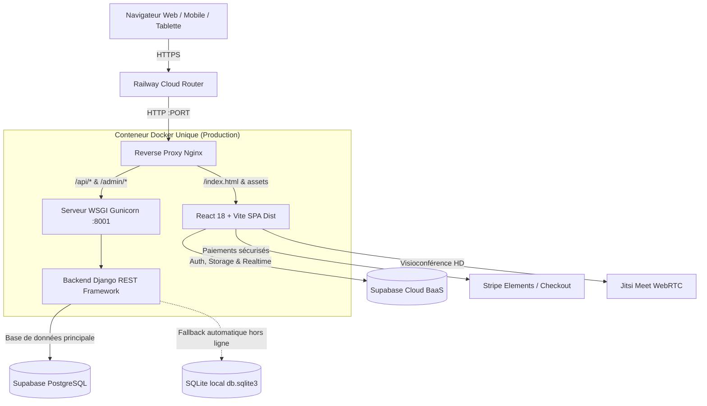

# FranceJustice / Law Just — Plateforme Juridique Nationale 🇫🇷

Une plateforme juridique numérique de pointe interconnectant Citoyens, Avocats au Barreau, Étudiants en Droit, Professeurs de Droit, Doctorants/Chercheurs et Administrateurs dans un écosystème 100% synchronisé en temps réel.

---

## 🏗️ Architecture Globale & Déploiement

La plateforme repose sur une architecture hybride conteneurisée prête pour la production (**Railway**, **Docker**, **Supabase**) :



- **Frontend** : React 18, Vite, TypeScript Strict, Tailwind CSS v4, Framer Motion, Lucide Icons.
- **Reverse Proxy** : Nginx avec résolution dynamique des ports (`$PORT`, 80, 8080, 3000), terminaison proxy SSL préservée (`X-Forwarded-Proto`), en-têtes de sécurité OWASP et buffer uploads 50 Mo.
- **Backend API** : Python 3.12, Django, Django REST Framework, WhiteNoise, Gunicorn.
- **BaaS & Temps Réel** : Supabase (PostgreSQL, Auth JWT, Row Level Security, Storage Buckets, Canaux Realtime).
- **Intelligence Artificielle** : Moteur Agentique Multi-LLM (Google Gemini 2.5 Pro, Claude 3.5 Sonnet, GPT-4o, DeepSeek V3) avec exécution d'outils juridiques autonomes.

---

## 📱 100% Responsive Design & Synchronisation Temps Réel

L'application a été conçue et testée pour offrir une expérience fluide et réactive sur **100% des tailles d'écrans** :

- 📱 **Smartphones (320px – 640px)** :
  - Tiroir coulissant (drawer) pour les sessions d'analyse juridique avec fond flouté (`backdrop-blur`).
  - Hauteur dynamique fluide `100dvh` prenant en compte la barre d'adresse rétractable iOS Safari / Android Chrome.
  - Prévention du zoom automatique iOS (`text-base sm:text-sm`).
  - Menus tactiles, formulaires multi-étapes et boutons d'action adaptatifs.
- 📱 **Tablettes (641px – 1024px)** : Grilles intelligentes 2 colonnes, tableaux de bord avec panneaux rétractables.
- 💻 **Laptops & Desktops (1025px – 1920px)** : Affichage complet multi-colonnes, inspecteur de pièces jointes et visualisations interactives.
- 🔄 **Synchronisation Multi-Appareils** :
  - Persistance dans `legal_diagnostics_just` avec identifiants normalisés UUID v4.
  - Écoute active via canal Supabase Realtime : un diagnostic ou échange initié sur ordinateur se synchronise immédiatement sur smartphone en direct.

---

## 👥 Comptes & Accès de Démonstration

Chaque rôle dispose d'un parcours sur mesure synchronisé avec **Supabase Auth & Database** :

| Rôle | Identifiant / Email | Mot de passe | Espace dédié |
| :--- | :--- | :--- | :--- |
| 🛡️ **Administrateur** | `justlaw@gmail.com` | `Just1@` | Dashboard Admin & Supervision Globale |
| 👤 **Citoyen / Particulier** | `just@gmail.com` | `Just1@` | Espace Citoyen & Agent IA Diagnostic |
| 🎓 **Étudiant en Droit** | `etudjust@gmail.com` | `Etudjust1@` | Salles de Classe, Masterclasses & Revues |
| 👨‍🏫 **Professeur de Droit** | `profjust@gmail.com` | `Profjust1@` | Animation Visioconférences & Cours Live |
| 🔬 **Doctorant / Chercheur** | `doctjust@gmail.com` | `Doctjust1@` | DrD. IMAM — Espace Recherche & Thèses |
| ⚖️ **Avocat au Barreau** | `lawyer@francejustice.fr` | `Lawyer123@` | Espace Cabinet, Devis & Visio Client |

---

## 🤖 Fonctionnalités de l'Agent IA France Justice (2026)

### 1. Analyse de Dossier & Exécution d'Outils (Autonomous Tools)
- **Extraction Multiformat** : Prise en charge des fichiers PDF (natifs et scannés), DOCX, TXT, images (JPEG/PNG) avec assainissement des flux binaires.
- **Outils d'Instruction** :
  - `inspect_dossier_documents` : Analyse des pièces jointes et des clauses contractuelles.
  - `search_jurisprudence_doctrine` : Recherche de décisions de justice et textes du Code civil, Code du travail, Code de la consommation.
  - `calculate_prescription_delays` : Calcul automatique des délais de forclusion et prescription.
  - `verify_court_competence` : Détermination de la juridiction compétente (TJ, CPH, Tribunal de Commerce).

### 2. Rédaction d'Actes & Signature Électronique eIDAS
- Rédaction assistée de mises en demeure formelles, requêtes et protocoles d'accord.
- Module de **Signature Électronique eIDAS** intégré avec horodatage certifié, traçabilité IP et aperçu du sceau juridique.
- Export direct au format Word (`.doc`) et PDF prêt pour notification LRAR.

### 3. Contrôle des Clés API & Modèles Personnalisés
- Sélecteur de cerveaux LLM : **France Justice Auto**, **Gemini 2.5 Pro**, **Claude 3.5 Sonnet**, **GPT-4o**, **DeepSeek V3**.
- Modal de configuration permettant à l'utilisateur d'injecter ses propres clés API chiffrées en local.

---

## 📹 Autres Services Majeurs

- **Visioconférences HD Sécurisées** : Salles de classe virtuelles et rendez-vous avocat/client chiffrés (Jitsi Meet / WebRTC) conformes à l'Article 66-5 du secret professionnel.
- **Paiements Stripe Sécurisés** : Règlement d'honoraires et devis juridiques certifiés PCI-DSS Niveau 1.
- **Planning National des Formations** : Agenda interactif des colloques, masterclasses et audiences.
- **Annuaire Géolocalisé des Juridictions** : Cartographie interactive des Tribunaux judiciaires, Cours d'appel et Conseils de prud'hommes.
- **Centre de Revues Scientifiques** : Consultation et publication de thèses et articles doctrinaux.

---

## 🚀 Déploiement Railway & Docker

Le projet est configuré pour se déployer en un clic sur **Railway** via son conteneur Docker optimisé :

### Fichiers de Déploiement Clés
- [`Dockerfile`](Dockerfile) : Multi-stage build (Node 20 Alpine pour Vite + Python 3.12 Slim pour Nginx/Gunicorn).
- [`railway.json`](railway.json) : Configuration du build Dockerfile, point de contrôle de santé `/health` et politique de redémarrage.
- [`nginx.conf.template`](nginx.conf.template) : Gabarit Nginx avec substitution dynamique des ports et routage `/api/`, `/admin/`, `/static/`.
- [`entrypoint.sh`](entrypoint.sh) : Script de démarrage automatique de Gunicorn, exécution des migrations et lancement Nginx.

### Variables d'Environnement Recommandées (Railway / Production)

| Variable | Description |
| :--- | :--- |
| `PORT` | Injecté automatiquement par Railway (par défaut 80/8080) |
| `DJANGO_SECRET_KEY` | Clé secrète de production Django |
| `ALLOWED_HOSTS` | Liste des domaines (par défaut `*`, `.railway.app`, `.up.railway.app`) |
| `DATABASE_URL` | URL de connexion PostgreSQL (ex: Supabase Transaction Pooler) |
| `VITE_SUPABASE_URL` | URL de votre projet Supabase |
| `VITE_SUPABASE_ANON_KEY` | Clé publique anonyme Supabase |
| `VITE_STRIPE_PUBLIC_KEY` | Clé publique Stripe |
| `GEMINI_API_KEY` | Clé API Google Gemini pour l'Agent IA |

---

## 💻 Démarrage en Développement Local

### Prérequis
- Node.js 20+ et npm
- Python 3.12+ (optionnel pour le backend local)

```bash
# 1. Cloner le dépôt
git clone https://github.com/cons-cloud/francejustice.git
cd francejustice

# 2. Installer les dépendances Frontend
npm install

# 3. Lancer l'environnement de développement
npm run dev:frontend

# Ou lancer Frontend + Backend simultanément :
npm run dev
```

### Vérification de Build
```bash
npm run build
```
*Le build TypeScript et le bundling Vite sont validés avec 0 erreur.*

---

## 🔒 Sécurité & Conformité

- **Row Level Security (RLS)** : Activé sur l'intégralité des tables Supabase (`legal_diagnostics_just`, `profiles_just`, etc.).
- **Conformité RGPD / CNIL** : Chiffrement des données en transit (TLS 1.3) et au repos (AES-256).
- **Secret Professionnel de l'Avocat** : Respect de la loi du 31 décembre 1971 pour les consultations privées.

---

**FranceJustice** — *L'Écosystème Juridique Numérique de Référence.* 🇫🇷