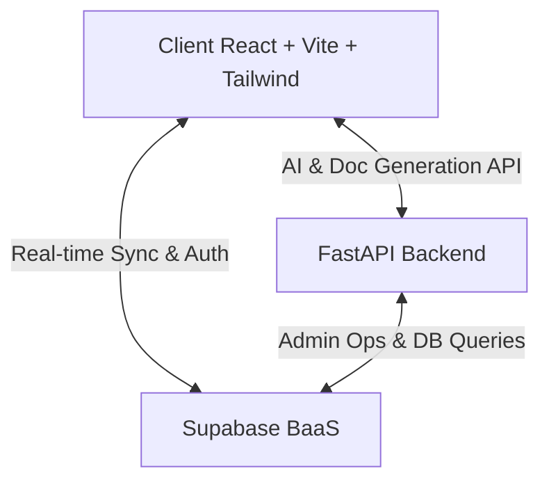

# ⚖️ Law Just — Plateforme Juridique & Accès Universel au Droit

> **La justice : un droit fondamental pour tous.** Une passerelle technologique et solidaire facilitant l'accès au droit français et marocain pour les citoyens, tout en offrant des outils puissants aux avocats pour gérer leur activité.

---

## 🌍 Vision & Mission

**Law Just** est né d'une volonté de démocratiser le droit et de faciliter l'accès à l'assistance juridique pour tous, en particulier pour les personnes vulnérables ou éloignées des ressources juridiques. En combinant l'intelligence artificielle de pointe avec l'expertise d'avocats professionnels, Law Just propose une plateforme moderne, fluide, sécurisée et hautement interactive.

La plateforme facilite :
- L'orientation juridique rapide des citoyens grâce à un **assistant conversationnel IA intelligent** qui simplifie le langage juridique.
- La **mise en relation directe** et simplifiée avec des avocats spécialisés par domaine et par ville.
- La **génération automatisée de documents juridiques** (plaintes, recours gracieux, mises en demeure) pour accompagner les démarches administratives.
- L'éducation citoyenne au droit via une base de données de **fiches pratiques** et un flux d'actualités juridiques mis à jour en continu.

---

## 🛠️ Stack Technique

Le projet repose sur une architecture moderne, fluide et sécurisée :



### 1. Frontend (React + Vite)
- **Framework & Bundler** : React 18 + Vite (HMR ultra-rapide) + TypeScript.
- **Design & Style** : Tailwind CSS v4 avec gestion complète du responsive, un **Dark Mode** natif, des composants personnalisés fluides, et une interface épurée s'inspirant d'un design professionnel de type "glassmorphism".
- **Iconographie** : `lucide-react` pour une identité visuelle claire et professionnelle.
- **Routing & State** : React Router DOM et gestion d'état centralisée par Contexts/Hooks.

### 2. Backend & Database (Supabase)
- **Base de données** : PostgreSQL hébergé sur Supabase.
- **Sécurité (RLS)** : Activation stricte du *Row Level Security* (sécurité au niveau des lignes) pour garantir la confidentialité absolue des documents juridiques (`documents`), des rendez-vous et des conversations privées des utilisateurs.
- **Temps Réel (Realtime)** : Synchronisation instantanée des rendez-vous, de l'état de validation des avocats, des notifications et des messages de chat.
- **Triggers & Procédures PostgreSQL** : Automatisation complète des workflows :
  - Création automatique du profil utilisateur (`profiles`) lors de l'authentification.
  - Notification en temps réel des utilisateurs et des avocats lors de la création ou modification de rendez-vous (`appointments`).
  - Système de gestion de droits d'accès administratifs globaux.

### 3. API Complémentaire (FastAPI)
- **Framework** : Python + FastAPI (titre : *Law Just Backend API*).
- **Rôle** : API dédiée à la génération dynamique des documents juridiques complexes, au traitement de l'intelligence artificielle pour la recherche juridique et à la synchronisation avancée des données utilisateur.
- **Tests** : Suite de tests automatisés configurée pour valider la robustesse de l'authentification et des requêtes vers l'API.

---

## 🚀 Fonctionnalités Clés

### 🔍 1. Assistant Juridique IA & Recherche Intelligente
- Outil d'analyse sémantique et de recherche de jurisprudence ou de textes de loi en langage naturel.
- Explications vulgarisées par l'intelligence artificielle pour rendre les articles de loi compréhensibles par tous.
- Historique de recherche (`search_history`) pour offrir des suggestions personnalisées et des analyses comportementales (respectant le RGPD).

### 📅 2. Gestion des Rendez-vous & Consultations en Temps Réel
- Réservation en ligne de créneaux de consultation juridique avec des avocats spécialisés.
- Suivi du statut des rendez-vous en temps réel : En attente (`pending`), Confirmé (`confirmed`), Annulé (`cancelled`), Terminé (`completed`).
- Messagerie sécurisée intégrée permettant l'échange confidentiel de pièces justificatives et de notes de dossier.

### ⚖️ 3. Annuaire des Avocats Spécialisés
- Répertoire complet des avocats membres du réseau.
- Recherche multicritère performante : filtrage par ville/localisation, spécialités (droit pénal, droit de la famille, droit du travail, etc.), années d'expérience et disponibilité.
- Processus de vérification strict des avocats (`verification_status` : pending, approved, rejected) via l'inscription de leur numéro de licence et de leur barreau de rattachement.

### 📝 4. Générateur Automatique de Documents & Espace Client
- Création automatique de documents légaux pré-remplis : plaintes, pré-plaintes en ligne, mains courantes et recours gracieux.
- Formulaires multi-étapes guidés et interactifs avec validation de données en temps réel.
- Coffre-fort numérique sécurisé permettant aux clients et aux avocats de téléverser et de partager des documents importants (`identity`, `license`, `legal_template`, `client_document`).

### 📚 5. Actualités Juridiques & Base de Connaissances
- Section blog alimentée par des articles de doctrine et d'actualité juridique rédigés par les avocats de la plateforme.
- Fiches explicatives classées par grandes catégories du droit français et marocain.
- Moteur de recherche d'articles de code accessible directement au public.

### 💳 6. Services d'Assistance & Gestion des Paiements
- Intégration transparente avec Stripe pour la gestion des transactions financières liées aux forfaits d'abonnement ou aux honoraires de consultation.
- Journalisation complète et sécurisée des paiements (`payments`) avec prise en charge multi-devises (notamment en Dirham Marocain - MAD).

---

## 🗄️ Structure de la Base de Données (Schema SQL)

La base de données s'appuie sur plusieurs tables clés interreliées :

1. **`profiles`** : Gère l'authentification et les informations de base des utilisateurs selon 3 rôles distincts (`user` pour les citoyens, `lawyer` pour les professionnels, `admin` pour la gestion).
2. **`lawyers`** : Extension détaillée des profils d'avocats contenant le barreau, le numéro de licence, l'expérience, les spécialités, l'adresse du cabinet, la notation et le statut de vérification administrative.
3. **`appointments`** : Enregistre les rendez-vous pris entre les citoyens et les avocats, la date/heure planifiée, le statut, les notes cliniques/juridiques et les informations d'honoraires.
4. **`documents`** : Coffre-fort de fichiers partagés classés par type (pièce d'identité, licence professionnelle, modèle légal, document client).
5. **`ai_conversations`** : Historique conversationnel sécurisé entre l'utilisateur et l'assistant juridique IA.
6. **`legal_news`** : Articles de blog et de doctrine rédigés par les avocats avec support d'articles à la une (`is_featured`) et URLs propres (`slug`).
7. **`services`** : Liste dynamique des offres d'assistance juridique et des forfaits disponibles sur la plateforme.
8. **`payments`** : Historique des paiements de consultations ou d'abonnements relié aux intents Stripe.
9. **`search_history`** : Enregistrement anonymisé des requêtes de recherche IA à des fins d'amélioration de la base de données.
10. **`contact_messages`** : Formulaire de contact public pour la prise en charge des questions de support.

---

## 💻 Installation & Lancement Local

### Prérequis
- **Node.js** (v18+)
- **Python 3.10+** (pour l'API complémentaire)
- Un projet **Supabase** actif.

### 1. Configuration des variables d'environnement
Créez un fichier `.env` à la racine du projet et configurez les variables suivantes :
```env
VITE_SUPABASE_URL=https://votre-projet.supabase.co
VITE_SUPABASE_ANON_KEY=votre-cle-anonyme
SUPABASE_URL=https://votre-projet.supabase.co
SUPABASE_KEY=votre-cle-service-role
```

### 2. Initialisation de la Base de Données (Supabase)
Exécutez le script SQL complet disponible dans [backend/schema.sql](file:///Volumes/TOSHIBA/Maroc-gestion-entreprendre/law_just-main/backend/schema.sql) directement dans le **SQL Editor** de votre console Supabase. Ce script créera l'ensemble des tables, types ENUM, index de performance, tables en temps réel et politiques RLS strictes.

### 3. Lancement du Frontend (Vite)
```bash
# Installation des dépendances
npm install

# Lancement du serveur de développement
npm run dev
```
Le frontend est alors accessible sur `http://localhost:5173`.

### 4. Lancement de l'API Backend (FastAPI)
```bash
# Se rendre dans le dossier backend
cd backend

# Installer les dépendances Python
pip install -r requirements.txt

# Démarrer le serveur de l'API
python main.py
```
L'API complémentaire tourne sur `http://localhost:8000`.

---

## 🤝 Contribution & Soutien

Ce projet est activement soutenu et enrichi par la communauté des **Avocats, Juristes et Développeurs** soucieux de faciliter l'accès au droit.
Pour contribuer au code source, proposer de nouveaux modèles de documents juridiques ou faire enregistrer un nouveau barreau, n'hésitez pas à nous contacter ou à soumettre une Pull Request.

*Law Just — Simplifiez votre accès au droit.*
